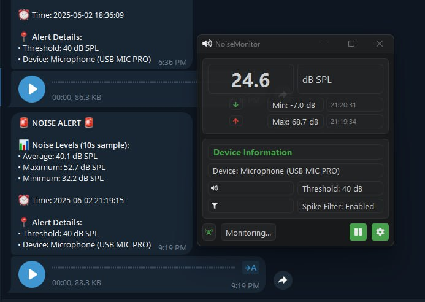

# 🎤 Server Noise Monitor with Telegram Alerts

[](https://github.com/VictorNoxx/noiceControll/blob/main/LICENSE)
[](https://www.python.org/downloads/)
[](https://core.telegram.org/bots)
[](https://github.com/VictorNoxx/noiceControll/releases)



## 🎯 What is NoiceControll?

NoiceControll is an advanced noise monitoring solution that helps you keep track of sound levels in various environments. Whether you're monitoring server rooms, baby rooms, home security, or workplace noise levels, NoiceControll provides real-time alerts and audio samples when noise thresholds are exceeded.

### 🔍 Perfect For:
- **Server Room Monitoring**: Detect unusual fan noise or hard drive sounds
- **Baby Monitoring**: Get alerts when your baby needs attention
- **Home Security**: Audio-based intrusion detection
- **Workplace Safety**: Monitor machinery noise levels
- **PC Health**: Track computer fan noise and performance
- **Remote Equipment**: Monitor remote locations for unusual sounds
- **Pet Monitoring**: Keep an ear on your pets when you're away

## 📸 Live Demo


## 🚀 Key Features

- **Real-time Noise Monitoring**: Continuous monitoring of ambient noise levels using system microphones
- **Multi-Device Support**: Monitors all available audio input devices simultaneously
- **Telegram Integration**: 
  - Instant alerts when noise levels exceed thresholds
  - Audio sample delivery via Telegram
  - Customizable alert messages
- **User-friendly GUI**: 
  - Easy-to-use interface for monitoring and configuration
  - Real-time noise level visualization
  - Historical data graphs
- **Advanced Audio Features**:
  - Audio sample recording when threshold exceeded
  - Frequency analysis for noise pattern detection
  - Spike filtering to avoid false alerts
- **Smart Notifications**:
  - Customizable threshold levels
  - Time-based alert rules
  - Alert cooldown periods
- **Cross-platform Support**: Works on Windows, Linux, and macOS (primary focus on Windows)

## 🔧 Technical Features

- Root Mean Square (RMS) calculation for accurate noise level measurement
- Configurable sampling rates and monitoring intervals
- Low system resource usage
- Customizable alert thresholds
- Historical data logging for trend analysis
- Background operation mode
- Audio compression for Telegram delivery
- Multiple audio format support
- Automatic device switching on failure

## 📋 Prerequisites

- Python 3.8 or higher
- Connected microphone or audio input device
- Internet connection (for Telegram alerts)
- Telegram Bot Token (for notifications)

## 📦 Installation

### Windows Executable
1. Download the latest release from our [Releases page](https://github.com/VictorNoxx/noiceControll/releases)
2. Extract the ZIP file
3. Run `NoiceControll.exe`

### From Source
1. Clone the repository:
```bash
git clone https://github.com/VictorNoxx/noiceControll.git
cd noiceControll
```

2. Install dependencies:
```bash
pip install -r requirements.txt
```

3. Configure Telegram bot (optional):
   - Create a new bot using [@BotFather](https://t.me/botfather)
   - Copy your bot token
   - Add token to configuration file

### Building from Source
To build the executable yourself:
```bash
python -m pip install pyinstaller
python build.py
```
The executable will be created in the `dist` directory.

## 🚀 Usage

### GUI Mode
```bash
python noise_monitor_gui.py
```
or run `NoiceControll.exe` if using the Windows release.

### Command Line Mode
```bash
python noise_monitor.py
```

## ⚙️ Configuration

- `NOISE_THRESHOLD`: Default 40 dB (adjustable)
- `SAMPLING_INTERVAL`: Default 2 seconds
- `ALERT_COOLDOWN`: Default 300 seconds (5 minutes)
- `RECORD_DURATION`: Default 10 seconds for audio samples
- `LOG_FILE`: Logs stored in 'noise_logs.txt'
- `SPIKE_FILTER`: Enabled by default to prevent false alerts

## 🔍 Use Cases

1. **Server Room Monitoring**
   - Detect failing hard drives
   - Monitor cooling system performance
   - Identify abnormal server behavior
   - Track UPS and power system sounds

2. **Data Center Management**
   - Early warning system for hardware issues
   - Environmental monitoring
   - Preventive maintenance scheduling
   - HVAC system monitoring

3. **Remote Hardware Monitoring**
   - Unattended server monitoring
   - Remote office equipment supervision
   - Infrastructure health checking
   - Equipment failure prediction

4. **Home & Office Security**
   - Break-in detection
   - Glass break monitoring
   - Equipment malfunction alerts
   - After-hours activity monitoring

5. **Baby & Pet Monitoring**
   - Cry detection
   - Pet distress alerts
   - Sleep pattern monitoring
   - Environment noise tracking

## 🤝 Contributing

Contributions are welcome! Please feel free to submit a Pull Request. For major changes, please open an issue first to discuss what you would like to change.

## 👥 Contributors

- [@VictorNoxx](https://github.com/VictorNoxx) - Project maintainer
- [@artickc](https://github.com/artickc) - Core contributor
- NOXX Agency - Copyright holder

## 📄 License

This project is licensed under the MIT License - see the [LICENSE](LICENSE) file for details.

## 🔗 Related Projects

- Server Monitoring Tools
- Hardware Diagnostics
- Telegram Bot Implementations
- Audio Analysis Tools
- Sound Level Meters
- Acoustic Monitoring Systems

## 🏷️ Keywords

server monitoring, noise detection, hardware diagnostics, server room monitoring, data center management, telegram alerts, acoustic monitoring, preventive maintenance, server health check, remote monitoring, noise threshold detection, hardware failure prediction, audio analysis, system administration tools, server room acoustics, baby monitor, pet monitor, home security, sound level meter, decibel meter, audio surveillance, noise level monitoring, sound analysis, audio alert system, machine learning noise detection, predictive maintenance, IoT sound monitoring, smart home security, audio pattern recognition, real-time audio monitoring, sound threshold alerts, ambient noise monitoring, acoustic analysis software, audio security system

---

Made with ❤️ by NOXX Agency
